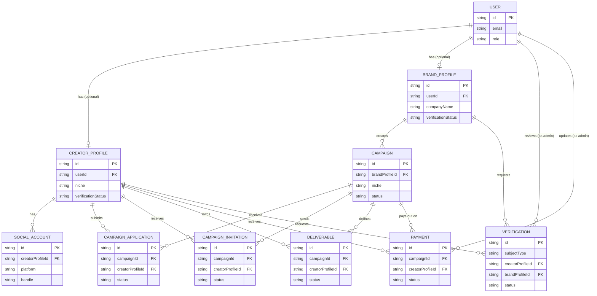

# Architecture Overview — Day 1

Companion to [`database-schema.md`](./database-schema.md) and
[`api.md`](./api.md). This doc covers the "how it fits together" — stack,
auth model, and the decisions made to get to a reviewable Day 1 state.

## Status

This is an **architecture and documentation milestone**. No API route
handlers for campaigns, applications, invitations, deliverables, payments or
verification exist yet — those are next, once this is reviewed and signed
off. What already exists in the repo: project scaffold, the Prisma schema
this doc describes, and authentication (signup/login/session/role-based
route protection) from Day 0.

## Tech stack

- **Framework:** Next.js (App Router, TypeScript) — serves both the frontend
  and the API routes (`src/app/api/**/route.ts`) from one codebase. There is
  currently no separate backend service; "the backend" means these API
  routes plus the Prisma layer.
- **Database:** PostgreSQL, accessed through **Prisma ORM** for type-safe
  queries and migrations. `prisma/schema.prisma` is the single source of
  truth for the data model — `database-schema.md` documents it in prose but
  the `.prisma` file is authoritative.
- **Auth:** NextAuth (Auth.js) v5, credentials provider (email + bcrypt
  password hash), JWT session strategy.
- **Validation:** Zod schemas for all request input, shared between the API
  route and (where relevant) the form on the frontend, so validation rules
  can't drift between client and server.

## Authentication & authorization model

- A session identifies a `User` and that user's `role`
  (`CREATOR`/`BRAND`/`ADMIN`). The role is read from the database at login
  time and baked into the signed JWT — **it is never accepted from the
  client** on any subsequent request. See `src/auth.ts` and
  `src/middleware.ts` from Day 0.
- `middleware.ts` enforces coarse-grained route protection by role prefix
  (`/creator/*`, `/brand/*`, `/admin/*`). This covers pages; it does not
  replace per-endpoint authorization.
- Every API endpoint documented in `api.md` re-checks authorization
  server-side regardless of what the middleware already did — "Owner
  (CREATOR)" style endpoints look up the resource's owning
  `creatorProfileId`/`brandProfileId` from the database and compare it to
  the session's own profile ID, not to anything the client submitted.
- Admin accounts are never created through the public signup endpoint (the
  signup Zod schema's `role` enum only contains `CREATOR`/`BRAND` — there is
  no code path that can mint an admin from a client request). Admins are
  provisioned via seed script or by another admin, once that tooling exists.

## Entity-relationship diagram

Notes on reading this diagram:
- `CREATOR_PROFILE` and `BRAND_PROFILE` each connect to `VERIFICATION` —
  these are two separate optional relationships (a `Verification` row
  belongs to exactly one of them, matched by `subjectType`), not a single
  three-way relationship.
- `CAMPAIGN_APPLICATION` and `CAMPAIGN_INVITATION` both sit between
  `CREATOR_PROFILE` and `CAMPAIGN` but represent different real-world
  actions (creator applies vs. brand invites) and can coexist for the same
  pair — see `database-schema.md` → Relationships → Many-to-many.

## Key Day 1 decisions & assumptions (summary)

Full reasoning for each lives in `database-schema.md`; summarized here for
quick reference:

1. **No separate "collaboration/workspace" table.** An accepted
   `CampaignApplication` or `CampaignInvitation` implies the active
   collaboration; `Deliverable` and `Payment` reference
   `(campaignId, creatorProfileId)` directly. Revisit if querying "all
   active collaborations" gets common/expensive.
2. **One `Payment` per `(campaign, creator)`**, lump-sum, not itemized per
   deliverable. Flag now if milestone payments are needed — it's a breaking
   schema change later.
3. **`Verification` uses two nullable FKs**, not a polymorphic `subjectId`,
   to keep referential integrity and type-safe Prisma queries. The "exactly
   one FK is set" rule is enforced in the API layer, not the database.
4. **Currency is whole INR rupees (`Int`)**, no paise. Flag if a payment
   gateway integration will need sub-rupee precision.
5. **One social account per platform per creator.** Flag if multi-account
   support (e.g. two YouTube channels) is needed.
6. **Single niche per campaign** (not a list), matching how a brand brief is
   written in practice; `platforms` is a list since campaigns commonly span
   multiple platforms.
7. **No live payment gateway.** `Payment.status` is a manually-updated
   ledger the admin controls via `PATCH /api/payments/:id`. The schema
   already has the fields (`paymentMethod`, `transactionReference`) a
   Razorpay/Stripe integration would eventually populate automatically
   instead of an admin typing them in.
8. **Repo location.** This documentation lives in the same repo as the
   Next.js app (`docs/`), not a separate backend repo — flag if the team
   has a dedicated backend repo this should move to instead.

## What's next (not Day 1)

- Implement the API routes documented in `api.md`.
- Creator Match Score engine (needs `CreatorProfile` + `Campaign` fields
  finalized — they are, as of this doc — plus a weighting config).
- Admin moderation/user-management endpoints, campaign analytics,
  notifications, disputes — intentionally deferred past Day 1.
